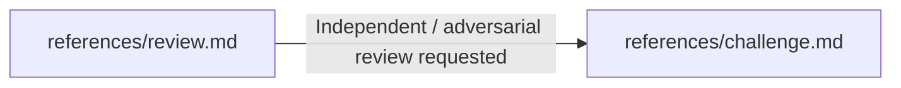

# Code Review

Load the review method; load the independent-challenge branch only when requested.

```mermaid
flowchart LR
  R[references/review.md] -->|Independent / adversarial review requested| C[references/challenge.md]
  click R "references/review.md"
  click C "references/challenge.md"
```
