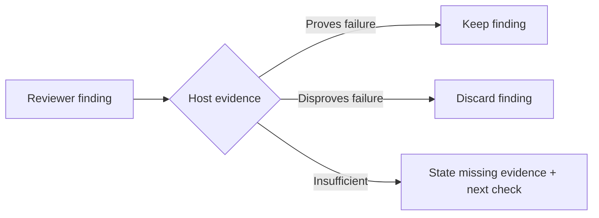

# Independent challenge

Apply only to an explicitly requested independent/adversarial review. Use an available separate reviewer within existing authorization; no fixed provider, model or custom runner. If independence cannot be provided, report that limit rather than label a self-review independent.

- Brief = accepted outcome + exact artifact/revision + constraints + owner/caller pointers + actual proof + unknowns. Provide enough context to test claims; omit author identity, previous verdicts and rebuttals that could bias the reviewer.
- Assignment = inspect without editing; reconstruct the intended outcome and try to disprove material claims. Seek a competing cause, missed caller, boundary/retry failure, weak test or simpler existing owner where relevant. Use the shared finding format; no mandatory checklist of unrelated concerns.
- Host = verify returned findings against source and, where useful, the cheapest discriminating check. Reviewer confidence and consensus are not proof. Only verified findings enter the defect list; preserve consequential unknowns as verification gaps.

