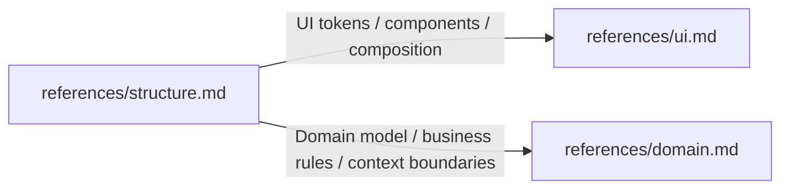

# Codebase Design

Load the shared structure reference + matching conditional references.

```mermaid
flowchart LR
  S[references/structure.md] -->|UI tokens / components / composition| U[references/ui.md]
  S -->|Domain model / business rules / context boundaries| D[references/domain.md]
  click S "references/structure.md"
  click U "references/ui.md"
  click D "references/domain.md"
```
