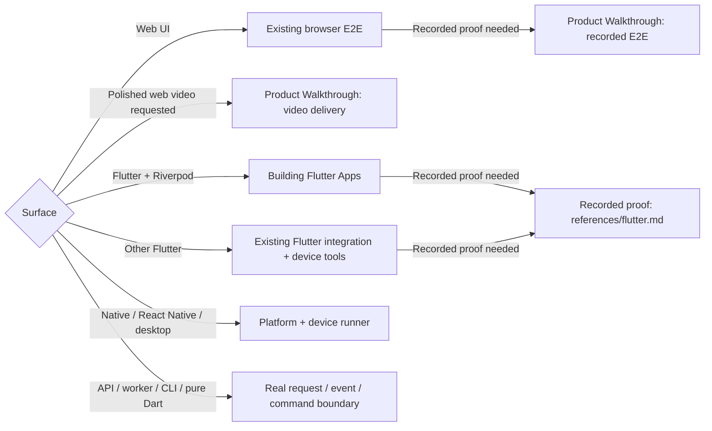

# E2E

## Routes

Select by actual surface + explicit browser/device requirements. Reuse the project's runner and fixtures; missing runtime/connection → identify the needed capability before setup.

OS-owned dialogs → platform control beyond the app tree. Browser exploration → durable regressions in existing tests. API/CLI journeys need UI runtime only when the journey includes it.

## Prove the journey

- Establish requested behavior, environment/build, actors, permissions and starting data. Exercise the real user path with stable semantic selectors and observable state waits.
- Choose the smallest cases covering the changed behavior and meaningful failures. Shared state needs independent writer/observer proof; persisted changes need source-of-truth readback. Cover denied/revoked access, retries or relaunch when the requirement depends on them.
- Keep cases isolated and repeatable using existing fixtures and cleanup. Do not substitute a mock, direct API mutation or test-only shortcut for the interaction being proved.
- Assert the visible result and relevant durable effects. A completed click, successful request, clean log or zero exit alone is insufficient. Investigate unexpected app/native/network errors and retries that only pass intermittently.
- On failure, preserve the reproduction and useful evidence; distinguish product, fixture, runner and capture defects. With fix authorization, correct the owner, rerun the original case and affected downstream cases, and retain a meaningful regression in the existing suite. Completion requires the corrected journey + affected checks to pass; otherwise report the exact blocker and remaining proof. Retries or weaker assertions do not resolve a defect.
- A user-reported defect reopens the affected journey's verification. Reproduce it, strengthen the assertion or review that missed it, and repeat the fix/retest loop; previous passing evidence cannot close the new report.

## Visual proof and completion

- Capture the smallest useful evidence set. Ordinary regression work does not require video. When screenshots or video are requested or needed, inspect the actual delivered media and confirm its subject, required steps and final state.
- Recorded proof follows the selected route's owner; backend readback + repeatable journey assertions stay here and media checks alone cannot prove acceptance. Captures outside an owned pipeline → existing artifacts + direct inspection; do not invent a compatible report.
- Keep secrets and personal data out of artifacts. Show requested evidence to the user; treat test artifacts as local unless their inclusion as repository assets is authorized.
- Report tested surfaces, outcomes and exact gaps separately. Assertions, persisted state, deployment identity and visual evidence prove different things. An unavailable device, account or unreviewed artifact remains unproven.
