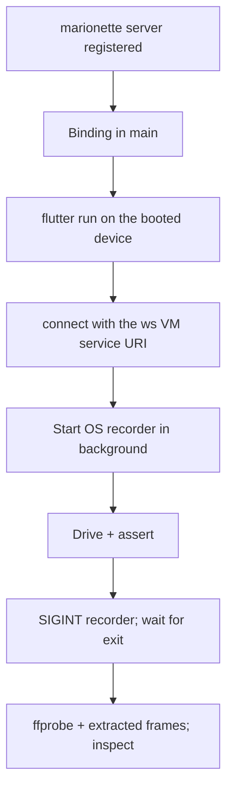

# Flutter recorded proof

Load when a Flutter journey needs recorded video evidence. Selector, configuration and entrypoint rules (rule 12 `lib/main_dev.dart`, optional runtime interaction, release/native limits) stay in [Flutter runtime E2E](../../building-flutter-apps/references/dart-mcp-e2e-testing.md). Journey assertions, durable-state readback and evidence reporting stay in [E2E](../SKILL.md#prove-the-journey).

Marionette taps and reads the running app; it never records. The recorder is a separate OS process capturing the device screen while Marionette drives.



## Server registration

- Trigger = any Flutter app (a `flutter` SDK dependency in `pubspec.yaml`). Hard Eng setup/update registers the `marionette` server as `dart run marionette_mcp@<pubspec.lock version>` when the lock records `marionette_flutter`, otherwise `dart run marionette_mcp@` (latest). No `dart pub global activate`. Registration alone drives nothing: the app binding below is still required.
- Detection runs only when setup installs or an update applies a newer verified revision; existing MCP entries are preserved, so a written pin does not follow a later lock upgrade. After adding or upgrading `marionette_flutter`, edit the `marionette` entry in `.mcp.json` (and `.codex/config.toml`) by hand to the locked version.
- Servers load at session start → start a new agent session after registration. Absent tools in the registering session are not a failed install.

## App binding

- `marionette_flutter` is a regular dependency, not a dev dependency: `lib/main.dart` imports it. Upstream 0.6.0 requires Flutter ≥ 3.27. Binding and server versions must match; a mismatch surfaces at `connect`.
- `MarionetteBinding.ensureInitialized()` = first line of `main()`. A test calling `main()` must not create a second binding, so guard on both `kDebugMode` and `FLUTTER_TEST`:

```dart
final isFlutterTest = Platform.environment.containsKey('FLUTTER_TEST');
if (kDebugMode && !isFlutterTest) {
  MarionetteBinding.ensureInitialized();
} else {
  WidgetsFlutterBinding.ensureInitialized();
}
```

- It must run before `SentryFlutter.init`, not inside its `appRunner`: Sentry claims the binding first and its zone swallows the resulting error, so the app hangs on the splash screen with no exception or log.
- Debug and profile builds only; the VM service does not exist in release. `main()` does not re-run on hot reload → hot restart after adding the binding.

## Connect + drive

- `flutter run` on the booted simulator/emulator, take the VM service URI from its output and pass the `ws://.../ws` form to `connect`. `connect` precedes every other tool.
- Drive with `get_interactive_elements` → `tap` (prefer `key`, then `identifier`, then `text`/`type`/`coordinates`), `enter_text`, `press_key`, `swipe`, `scroll_to`; read with `take_screenshots` and `get_logs` (needs a configured collector); `hot_reload`/`hot_restart` after code changes.
- On iOS/Android the platform keyboard owns field editing → change a field's value with `enter_text`, not `press_key`.

## Record the screen

Start the recorder in the background before driving and keep the printed pid; shell state does not survive between commands.

iOS simulator:

```sh
xcrun simctl io booted recordVideo --codec=h264 --force journey.mp4 &
echo $!
```

Android emulator (documented, not verified here): `adb shell screenrecord --time-limit 180 /sdcard/journey.mp4 &`, then `adb pull /sdcard/journey.mp4` after the stop below. 180 seconds is the default cap.

Stop with SIGINT and wait for the process to exit before reading the file; it writes the container while shutting down and prints `Recording completed. Writing to disk.`

```sh
kill -INT <pid>
while kill -0 <pid> 2>/dev/null; do sleep 0.2; done
```

## Verify the media

```sh
ffprobe -v error -select_streams v:0 -count_frames \
  -show_entries stream=codec_name,width,height,nb_read_frames:format=duration \
  -of default=nw=1 journey.mp4
```

- `duration` must cover the drive and `nb_read_frames` must exceed 1.
- The simulator recorder emits a frame only when the screen changes: a six-second capture of a static screen yields 1 frame and ~0.07s duration. That means nothing moved, not a broken recorder — fix the drive, not the recording command. On a single-frame file both extracted frames are that one frame.
- Extract and actually view both ends, plus the video itself; record what was seen as the evidence [E2E](../SKILL.md#visual-proof-and-completion) requires.

```sh
ffmpeg -v error -i journey.mp4 -frames:v 1 first.png
ffmpeg -v error -sseof -0.5 -i journey.mp4 -frames:v 1 last.png
```
