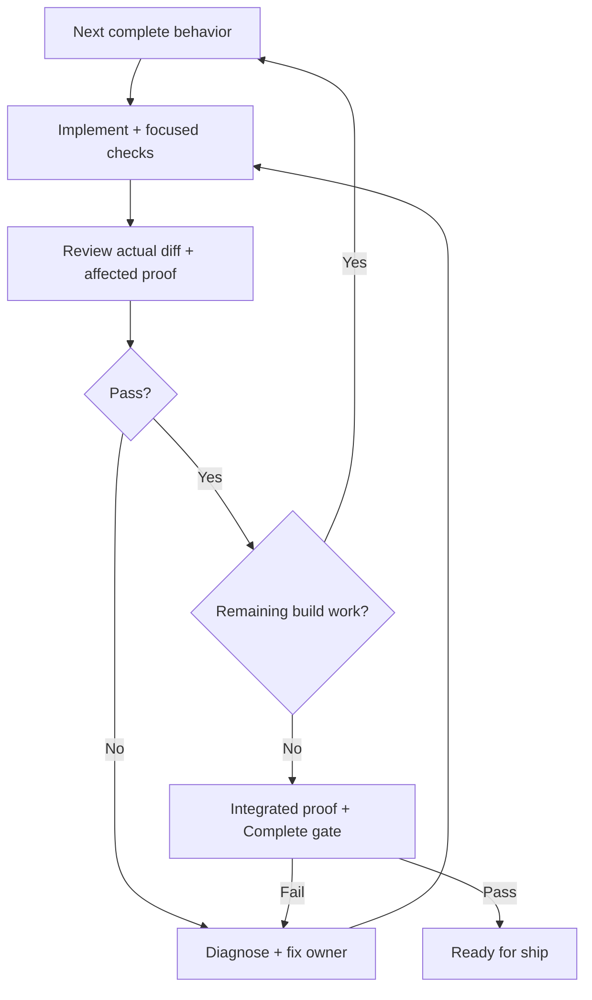

# Hard Eng Build

- Input = existing Ready + authorized plan from [HE Plan](../he-plan/SKILL.md); inspect its readiness evidence (passing baseline, applicable UX, blockers), not Status alone. Failed-baseline repairs alone may use its [authorized Draft repair route](../he/references/gates.md#baseline-repair); feature work remains blocked until repair delivery. Other missing, pending or contradictory readiness → that owner before production edits. Material scope change → same owner; preserve accepted decisions + completed work. Participation and project context → [HE workflow](../he/references/workflow.md).
- Output = locally implemented + verified behavior, Complete plan and explicit Ready for ship handoff. Build adds no authority to commit, push, publish, merge or deploy; delivery is a separate stage.

## Implement + verify

- Behavior = required connected callers, persistence, API and interface work; a skeleton or file checklist is not an accepted outcome. Keep changes at existing owners; apply relevant stack/design/security guidance only for the changed boundary.
- Proof = [test quality](../he/references/testing.md) + [actual-diff review](../code-review/SKILL.md); required runtime journeys, visual evidence and applicable accessibility states → [E2E](../e2e/SKILL.md). PR evidence selection → [HE Ship](../he-ship/references/checks.md#ui-evidence-in-the-pr). Reuse these owners for regression, defect reopening and review findings; no duplicate checker or mandatory test/agent count.
- Progress = same plan + remaining work. Retain the actual starting-baseline outcome + evidence; record later build results in Verification. Keep Status Ready and Verification Pending during an unblocked feature build; baseline repair follows HE Plan's Draft route above. A material decision or unavailable prerequisite → Draft + exact blocker/resume condition; preserve completed steps and continue independent authorized work. Never replace missing proof with a pass or N/A.

## Parallel work + integration

- Dispatch only independent complete behaviors with named owners, agreed interfaces and satisfied dependencies, within the task's delegation authorization. Small work stays with one builder. Check actual source and shared effects: generated files, lockfiles, fixtures, ports and databases can contend despite disjoint edit paths.
- Use isolation when needed; serialize conflicting work and shared Git operations. In a shared checkout, one owner controls each write surface; workers avoid installs, builds or tests that mutate another worker's state. Worktrees do not isolate external resources.
- Worker results = changed paths, actual commands/results and blockers in the normal handoff. Coordinator inspects the actual diff and shared contracts, integrates in dependency order, and runs required checks on the combined result. Preserve unowned changes. Worker passes or a clean merge do not prove integration.

## Build complete → ready for ship

- Reconcile the final diff against every accepted requirement and later correction, including the plan's explicit E2E disposition. Required local journeys must have Passed evidence; only deployment-dependent proof may remain Delivery under a Deploy target with its configured verifier. Confirmed review findings are resolved and no build blocker remains. Review claims against actual tests/runtime evidence; plan checkboxes alone are declarations.
- Record actual focused-test/runtime evidence in the plan, check only verified acceptance items, set Status Complete + Verification Passed, then run the existing [Complete check](../he/references/gates.md#plan-checks) on the final integrated code. Ready checks own planning/baseline readiness; do not repeat them as an extra build gate. Failure → follow that gate's Draft/blocker recovery and resume the loop; never announce Ready for ship. Code/configuration changes after a pass require affected proof + the final gate again.
- After the gate passes, tell the user `Ready for ship — local implementation and verification complete; delivery not performed.` Handoff = implemented outcome + actual checks/runtime evidence + pending delivery requirements. The Complete plan already records the stage; do not rewrite it or repeat application checks solely to record this announcement. Authorized delivery continues through [HE Ship](../he-ship/SKILL.md); build alone adds no delivery authority. No BUILD.md or second state record.
