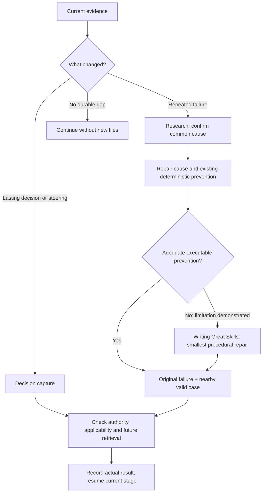

# Hard Eng Learn

- Input = current task + observed attempts/results or explicit decision/steering. Reuse its authorization + participation mode. Hook checkpoints request this judgment; they do not establish recurrence, a cause, or permission to change other projects/global memory.
- Outcome = verified prevention at its narrowest owner, an applicable decision record, or an explicit no-op/blocker. Keep proof + pending work in the same plan; no learning ledger or new task status. Existing tests/docs that already preserve the lesson need no duplicate record.

## Repeated failure → prevention

- Recurrence = compare the actual attempts, failing boundary + conditions; identical error wording is insufficient. Use [Research](../research/references/troubleshooting.md) for distinguishing evidence before another similar retry. A first confirmed false-pass/protected-boundary defect still warrants immediate repair through its current owner.
- Preference = remove the cause → repair existing invariant/type/test/checker/lint/hook/CI → add the smallest missing deterministic check. Reuse project-native tools. A new script needs repeated fragile logic or a required boundary existing commands cannot check; no checker per incident.
- Proof = the real violating case must fail before repair and pass after it; a nearby valid case must remain valid. Put the check where recurrence would be caught, retain required gates, and name coverage limits. Do not weaken a check or turn a passing command into proof without inspecting its result.
- Skill = last resort for the part executable prevention cannot adequately cover. State that limitation from evidence; reuse/repair an existing skill before adding one. Follow [Writing Great Skills](../writing-great-skills/SKILL.md), including its [repair route](../writing-great-skills/references/repair.md). Canonical location = `.agents/skills/<name>/SKILL.md`; only needed references/scripts belong beside it.
- Behavioral proof = exercise the original request + nearby valid/non-trigger case. Material trigger, authority, action-order or completion changes need actual agent execution; a wording/metadata check alone is insufficient. Verify the future consumer reaches the rule when relevant. Failed/unknown proof stays unfinished; never promise universal non-recurrence.

## Apply + continue

- Decisions/steering = [terse ADR capture](references/decisions.md). Inspect relevant accepted ADRs before applying a past lesson; current user instructions + verified applicability govern. A code/decision conflict may be a product regression, not stale documentation.
- Scope = authorized local prevention continues through [HE Build](../he-build/SKILL.md) with affected checks; post-ship edits need fresh proof and separately authorized [HE Ship](../he-ship/SKILL.md) delivery. Source-toolkit/global/cross-project changes require their own existing authority.
- Progress = fix risk at the affected stage; learning does not seize unrelated work. No useful durable gap → no new artifact. Missing evidence/authority → retain the concrete next action in the existing plan. A checkpoint, ADR or skill is never a substitute for implementation and proof.
