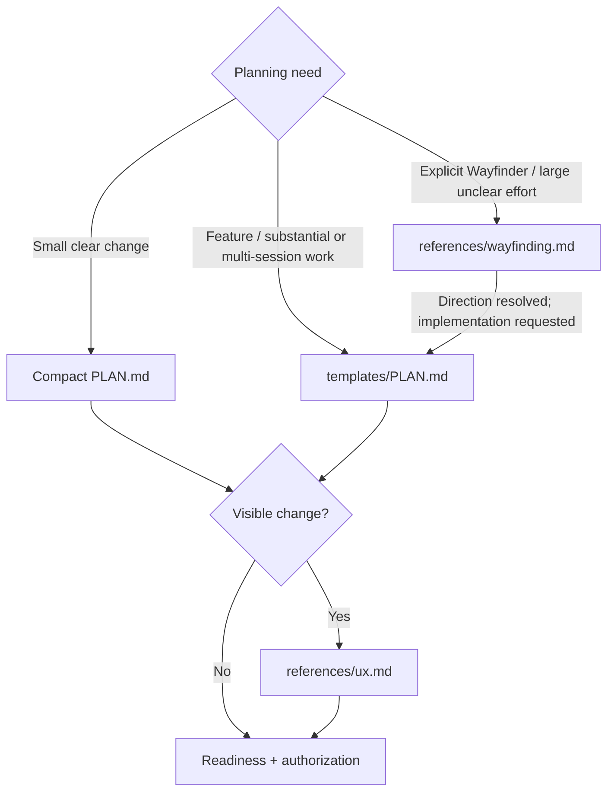

# Hard Eng Plan

- Output = ready plan + UX reference when applicable + baseline evidence + execution recommendation + authorization boundary, or explicit blocking decisions. Planning may produce the plan, research + isolated previews; production implementation waits for readiness + authorization.
- Context = [Hard Eng workflow](../he/references/workflow.md). Reuse current repository evidence + settled decisions; load [Research](../research/SKILL.md) or [Codebase Design](../codebase-design/SKILL.md) only when needed.

## Routes

Select from the user's intent + actual scope, not a keyword alone. Existing ready plan → continue within its authorization; material change → reopen only the affected decision.

## Plan + questions

- Tracked evidence = apply [publication privacy](../he-ship/references/checks.md#publication-privacy) before writing plans or attaching evidence.
- Both sizes = [PLAN.md](templates/PLAN.md); one plan per effort at root or `features/<slug>/PLAN.md` (filename case-insensitive). Reuse it. Write brief fields + `behavior → proof` checkboxes, not narrative paragraphs; link detailed evidence instead of copying it. Fill every section; `N/A — reason` must follow repository facts. Unavailable tools, failed checks + missing proof are blockers, never N/A.
- Questions = inspect repository facts first; ask only user-dependent choices that can change outcome, UX, scope or material risk. Resolve prerequisite choices first; batch independent questions with a recommendation + consequences. Never supply the human's answer or treat silence as approval. Clear request → no ritual interview.
- Setup/adoption/update = follow [integration setup](../he/references/integrations.md) for intended services, hosting, existing choices and real host readiness; greenfield imports alone cannot identify future integrations. New Flutter app = Riverpod per [Building Flutter Apps](../building-flutter-apps/SKILL.md).
- Proof = reconcile every material requested behavior + preserved constraint with an intended check + observable expected result in Acceptance + steps; explicitly mark exclusions or blockers. Fill the template's `E2E:` disposition separately from `ux_reference`: unchanged appearance does not waive an interaction journey. Use [test design](../he/references/testing.md) + [E2E](../e2e/SKILL.md) for applicable proof. Ready needs planned feature proof + actual baseline/UX evidence; Complete needs actual feature results. Deployment-only E2E requires Deploy and a configured verifier, never a Merge target that closes before runtime proof.
- Delivery = keep build acceptance local; retain the authorized destination + pending remote proof in Verification for [HE Ship](../he-ship/SKILL.md). Local Complete precedes shipping. Before UI implementation, retain the actual baseline for the later PR comparison even when planning used a mock; prepare task isolation.
- Flow gaps = for material state, permission, recovery or cross-system behavior, inspect existing entry points, relevant branches and success/failure/recovery outcomes before Ready. Reuse existing handlers; resolve consequential unspecified behavior through the questions above and carry the scenarios into acceptance. Settled low-risk work needs no extra walkthrough.
- Uncertainty = for a consequential unverified technical assumption, record current evidence, the cheapest discriminating check + what changes if false. Resolve planning-owned facts through research or an authorized isolated prototype; keep build-dependent details explicit for implementation. Unresolved product choices remain blockers; helper names and low-impact details do not.

## Before handoff

- Baseline (Start Gate B) = run the [Draft check](../he/references/gates.md#plan-checks) on the starting implementation after planning/UX, before approval or implementation; previews must not contaminate it. Reuse only matching code/configuration/environment evidence. Record command + actual result in the plan. Failure → [baseline repair](../he/references/gates.md#baseline-repair); no baseline waiver.
- Sequencing = each substantial slice delivers observable behavior; choose an early thin slice that exercises consequential uncertainty when present. Parallel work needs agreed dependency interfaces + a named integration check; avoid a nominal slice that leaves the risk untouched.
- Execution recommendation = smallest suitable arrangement for this plan: one builder for contained work; independent work may run in parallel; substantial work benefits from a fresh verifier. Name responsibilities, dependencies and actually available model/tool capabilities; do not invent model availability, force four agents or dispatch while planning. Respect existing delegation limits.

## Participation

Apply the existing [Human-loop or Autonomous mode](../he/references/workflow.md#participation); that owner defines proposal approval, progress and authority boundaries.

## Readiness + authorization

- Ready = outcome + boundaries understood; material blocking choices resolved; applicable `ux_reference` shown and its direction settled within the task's participation mode; baseline passed and any prerequisite repairs delivered; planned acceptance checks + actionable first step + execution recommendation. Deferred uncertainty stays explicit and must not contradict the authorized scope. After this passes and implementation is authorized, explicitly tell the user: `Ready for build — plan and baseline are verified; implementation is starting.` Do not use this handoff while proof is pending or blocked.
- Authority = user's conversation instructions under the participation rule above; plan records their scope, not a self-issued permission. Reuse valid proposal approval or autonomous authorization. Otherwise show the completed plan and ask once to proceed; plan-only requests end with the plan.
- Approval covers outcome + boundaries. File/step/test/internal approach changes → update the same plan and continue. Changed outcome, material scope/risk or an unauthorized consequential action → resolve that boundary only. Plan edits do not expire approval; no hashes, receipts or approval commands.
- Plan checks = pass the [Ready check](../he/references/gates.md#plan-checks) once material choices are resolved and before authorized implementation; missing previews keep the plan Draft. A proposal awaiting choices stays Draft with `Handoff: Approval`; a settled proposal may pass Ready before final combined approval. Review evidence + N/A reasons against actual work: a structural pass proves neither truth, scope relevance, authority nor chronology. Host-native read-only controls remain separate.
- Draft handoff = declare `Handoff: Clarification` or `Handoff: Approval` in Decisions + authorization. Clarification needs a concrete prerequisite in `Blockers` (for example, which application is in scope); it may pause before UX/baseline work. Approval includes asking the user to accept recommendations or choose between prepared proposals: show the relevant flow/states first and fill baseline, UX + planned E2E evidence. Do not label a proposal review as clarification. Stop rejects missing/invalid handoffs and incomplete approval evidence; one plan's question cannot excuse another plan's incomplete approval. This checks declarations, not conversational intent, actual approval or host compliance; feedback grants no authority. Older active Draft plans must choose the appropriate handoff before pausing.
- Handoff = ready + authorized + implementation requested → continue through [Hard Eng](../he/SKILL.md). Discovery-only Wayfinder sessions retain their charting/one-ticket stop boundaries.
