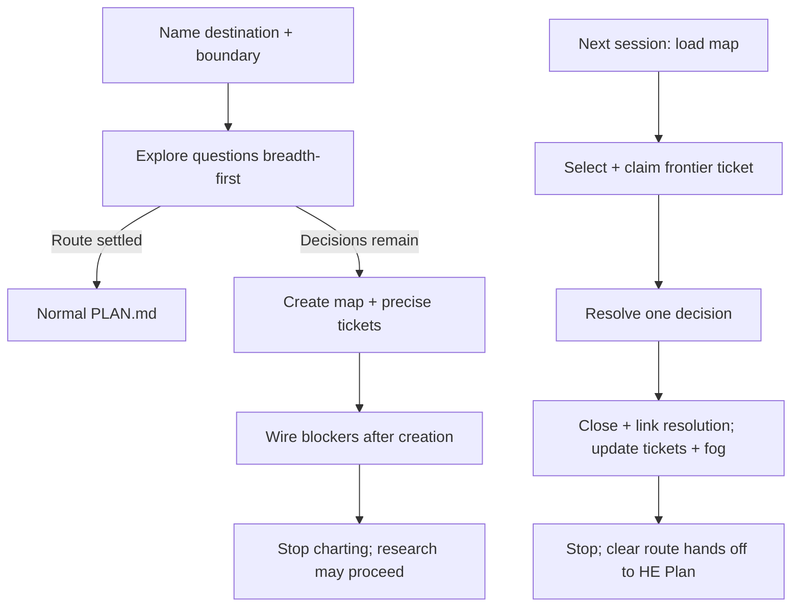

# Wayfinding

Load for an explicit Wayfinder request or unclear work spanning dependent decisions. A settled route → normal [HE Plan](../SKILL.md), without a map. HE Plan owns participation, questions, readiness + authorization; this reference owns the decision map.

## Method

- Destination = observable spec, decision or change this map makes reachable; fixes ticket scope. Resolve material human choices through live answers, never an invented human response.
- Map completion = direction clear. Implementation handoff → link map from [PLAN.md](../templates/PLAN.md), summarize scope + acceptance, apply HE Plan readiness + existing authorization.
- Charting resolves no decision itself. Research tickets may run in parallel through authorized, available subagents using [Research](../../research/SKILL.md); otherwise leave them on the frontier for a work session. No mandatory branch, tracker installation or companion package.
- Working a map = at most one decision ticket per session, except research. Load the map first, zoom into related tickets only as needed, and read applicable local skills named in Notes.
- Select the user-named ticket or first frontier ticket in stable tracker/filename order. Claim before work; a blocked or already claimed ticket requires its blocker/claim resolved first.

## Map + tickets

Map = low-resolution index; decision detail lives once, in its ticket. Refer to linked descriptive titles in user-facing text.

| Map section | Content |
| --- | --- |
| Destination | One or two lines defining the observable end + boundary. |
| Notes | Domain, applicable local skills, participation + standing preferences. |
| Decisions so far | One linked resolution summary per closed decision; initially empty. |
| Not yet specified | In-scope questions too blurry to state precisely; no decided, live-ticket or out-of-scope work. |
| Out of scope | Work beyond the destination + reason; link any closed mis-scoped ticket. |

- Ticket = descriptive title + `Question`, sized to one session; a decision/investigation, not a build slice. Fields: `Type`, `Status: open|closed`, `Assignee`, `Blocked by` links. Assets + evidence are linked from its resolution.
- Precise question → ticket, even if blocked. Blurry question → Not yet specified. Create tickets before wiring blockers; reject cycles.
- Frontier = open + unassigned + every blocker closed. Resolve → record answer + evidence/context pointers, close ticket, add linked resolution summary to map. Keep secrets out of pointers.
- Newly precise fog → new tickets, remove that fog, then wire blockers. Update invalidated tickets. Beyond-destination ticket → close + record reason under Out of scope, not Decisions so far; reconsider only in a newly scoped effort.

## Decision routes

| Type / condition | Action + completion |
| --- | --- |
| `research` — missing facts | [Research](../../research/SKILL.md); record supported findings + which question they answer. AFK within existing authorization. |
| `grilling` — human choice | [Plan + questions](../SKILL.md#plan--questions); HITL, resolved only by live human answers. |
| Domain meaning is disputed | Load [domain design](../../codebase-design/references/domain.md). Compare terms with code + existing glossary; resolve contradictions with the human and capture agreed terms in the existing domain reference or decision ticket. ADR only for a hard-to-reverse, surprising choice with real tradeoffs. |
| `prototype` — uncertain look or behavior | HITL: state the question, build the smallest isolated artifact, show it for the human's verdict, link artifact + verdict in the ticket. Visual choices → [UX reference](ux.md). |
| Logic prototype | Make it runnable; expose relevant inputs/state + awkward cases. Use throwaway code, with persistence only when persistence is the question. Record observed results; leave the human decision open until answered. |
| `task` — prerequisite blocks a decision | Complete the authorized prerequisite or give the human precise required steps; record resulting facts/access location. HITL or AFK as needed; the prerequisite does not authorize delivering the destination. |

## Tracker

Use the project's documented tracker when configured + authorized; native child relationships + blocking where supported. Map/ticket notes confer no authority for external writes, access changes, installation or publication.

No authorized tracker → local Markdown:

- Map = `features/<slug>/wayfinder/MAP.md` with the sections above; tickets = descriptively named sibling Markdown files. Directory supplies parentage, filename supplies identity.
- Local discovery edits need an applicable Draft [PLAN.md](../templates/PLAN.md) under [plan checks](../../he/references/gates.md#plan-checks). Link the map; keep decision detail in tickets. If the user forbids that plan, report the gate blocker.
- Claim = write worker identity in Assignee before work; never overwrite another claim. Serialize shared-file claims: Markdown has no atomic assignment guarantee.
- Resolution = append `## Resolution` + mark closed. `Blocked by` is a body convention, without native dependency rendering or concurrency guarantees.

Adapted from [Matt Pocock's Wayfinder](https://github.com/mattpocock/skills/blob/3cca18b368ae95cdbdebbff572ccafa662551015/skills/engineering/wayfinder/SKILL.md), revision `3cca18b368ae95cdbdebbff572ccafa662551015`, under the adjacent [MIT license](wayfinder.LICENSE).
