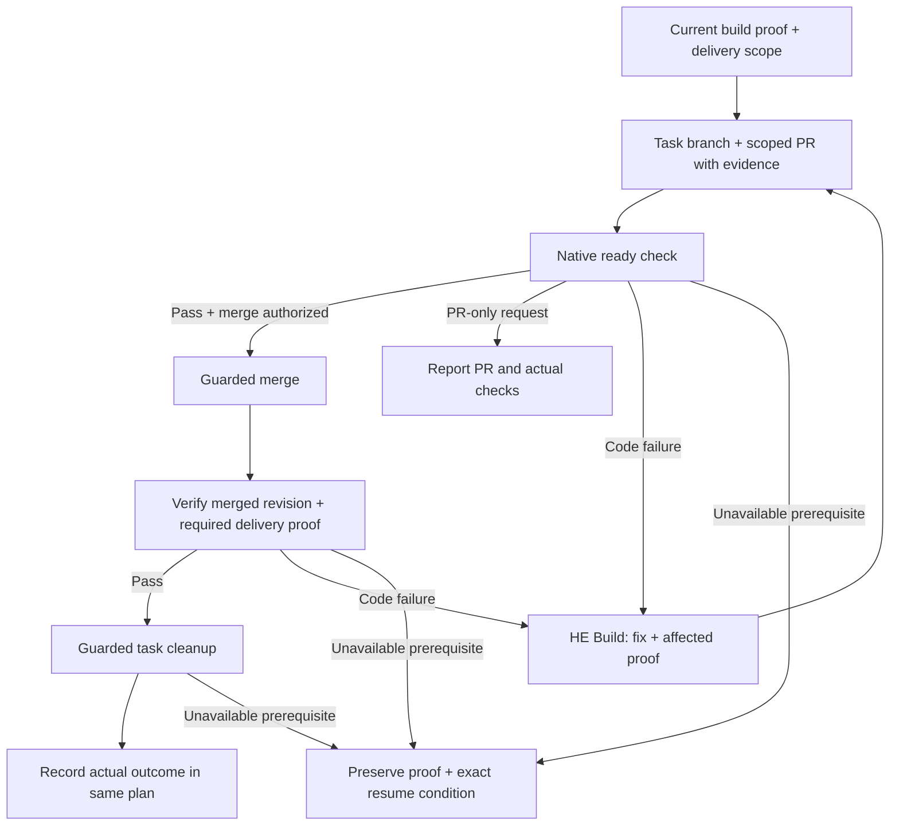

# Hard Eng Ship

- Input = [HE Build](../he-build/SKILL.md) local Ready-for-ship evidence + user's delivery scope. Reuse authorization; a skill, plan or green check adds none. Resolve the actual repository, branch/PR and requested environment from the task + project instructions. Missing material authority/target → finish safe preparation, then ask only for that boundary.
- Contract = [native shipping checks](references/checks.md); configure from repository facts in the existing gate file. Missing configuration/access/proof blocks. Use project-owned release commands and existing Git/`gh`; do not introduce a provider, tracker, upload service or watcher automatically.

## Prepare + deliver

- Isolation = reuse this task's branch/worktree + existing PR. If work began in a shared/base checkout, isolate the authorized changes before shipping; preserve unrelated staged/unstaged files. One coordinator owns Git/ref/environment mutations. No blanket staging, history rewrite or branch-rule change.
- Baseline repair = [HE Plan's prerequisite route](../he/references/gates.md#baseline-repair) requires its own delivery through verified main before feature work resumes. Finish the authorized Merge or Deploy target, including current remote CI; a PR-only handoff leaves the dependent feature blocked.
- UI evidence = inspect matching baseline/final route, state and viewport through [E2E](../e2e/SKILL.md). Appearance differs → publish the before/after pair; unchanged → comparison note without duplicate uploads. Use the [contract's formats](references/checks.md#ui-evidence-in-the-pr). Interactions still need their own proof. Missing baseline → recover it in isolation, never invent unchanged appearance. Preserve published proof through cleanup.
- PR = actual problem/result + scoped diff + tests/evidence + material risks. Resolve a matching existing PR before creating one. A failed lookup is unknown, not absence. PR creation does not grant merge authority. Recheck after source changes; handle actionable review findings through existing [Code Review](../code-review/SKILL.md) and HE Build.
- Publication = review the complete outgoing payload against [publication privacy](references/checks.md#publication-privacy) before publishing or updating it.
- Verification = native check on the current PR/revision; pending, skipped required work, an old green run or a successful command with missing proof cannot establish delivery. For Deploy, the configured project check must inspect the intended deployed revision and affected runtime through E2E. No generic health page or local screenshot substitutes for the changed remote behavior.
- Recovery = inspect the actual remote result before retrying interrupted actions. Code/config changes → HE Build + fresh affected/final checks. Delivery-only outages/permissions → preserve local Complete and record the unfinished delivery + exact resume condition. Use the project's scoped recovery procedure; no blind migration retry or rollback.

## Completion + cleanup

- Same plan = local build Complete remains distinct from `Delivery target: PR`, `Merge` or `Deploy` in Verification. An `E2E: Delivery` journey keeps the target Deploy until its configured runtime verifier passes. Retain full pending delivery requirements as prose; replace pending claims only with actual evidence. Never tick remote proof before it exists or create a second state file.
- Cleanup = only after confirmed merge and required delivery proof. Retain the same relative plan in the persistent checkout, recovering it from the verified merged revision if needed; preserve unrelated edits. Deliberately clean only known generated artifacts, then run the guard; preserve current/main, dirty/untracked/unknown ignored, locked, reused or changed task worktrees/branches. Initialized submodules or different fetch/push endpoints → retain the task for its repository-owned procedure. Do not delete another active task's checkout. Uncertain ownership/activity → retain it and report the blocker. No force-removal to make cleanup pass.
- Handoff = PR/revision + current CI result + required release/runtime proof + cleanup outcome + remaining limitations. Reconcile the existing plan and final report with those receipts and the observed installed revision; installed files or local Complete alone do not establish delivered setup. Say submitted, merged or deployed according to what happened. Credentials and publication rights remain external prerequisites.
- Post-merge receipts = final report + native remote evidence. Do not create a follow-up PR solely to replace pre-merge pending delivery prose in the merged plan; that plan records the requirements, not a second delivery ledger.
- Efficiency = reuse matching proof; measure pre-push/CI duration against configured project budgets. Optimize demonstrated setup/critical-path waste at the existing gate owner; retain required checks, latest-tool policy and failure detection. No repeated full review, fixed agent count, score target or unmeasured “fastest” claim.
