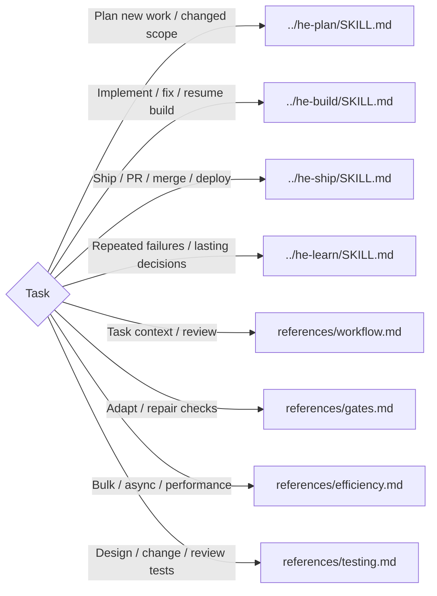

# Hard Eng

Select the matching route automatically from the task and current stage; no explicit skill invocation is required. Load only matching routes and continue to the next authorized stage when its prerequisites pass.

