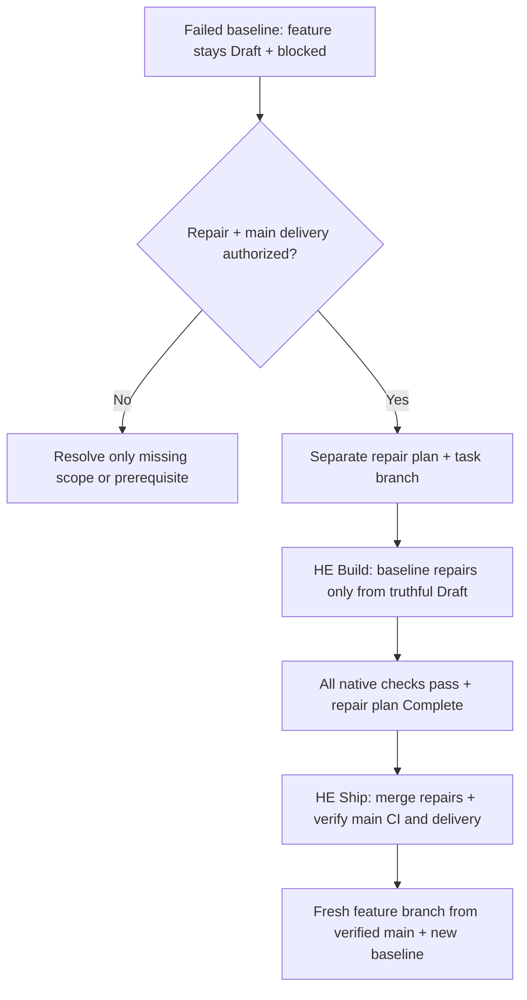

# Adapt + repair checks

Apply when adapting or repairing project checks; use native diagnostics for enforced requirements.

Plan migration: Ready/Complete plans now need an explicit `E2E:` disposition. When reopening or validating an older plan, derive it from that plan's recorded runtime evidence or a concrete inapplicability reason; missing evidence remains pending. Do not relabel historical tests as fresh execution or turn local proof into remote delivery.

| Agent decision | Required proof |
| --- | --- |
| Package/source coverage | Match actual production owners, nested packages + native workspaces. Review scan roots, generated/vendor attributes, ignored files and dynamic entry points; a clean report cannot prove omitted code was examined. |
| Affected selection | `depends_on` = reviewed direct package-impact edges from native manifests, workspace/service setup and root lockfile/tool providers; traversal includes transitive dependents. Missing mapping is unknown, not `[]`, so package checks stay full. A known no-change diff touching only plans or top-level Markdown other than `AGENTS.md` runs only the secret scan. Hard Eng config, workflow and scaffold changes stay full; root package/lockfile changes select that root + its reviewed consumers. |
| CI ownership | Inspect existing jobs before assigning Hard Eng work. Each required assertion has one job/owner; compare arguments, reports and thresholds before removing duplicates. Keep local native checks; integrate missing CI assertions into existing jobs and name their required results in `shipping.checks`. Setup preserves existing workflows and leaves adaptation pending; it generates a new workflow only with a project shipping policy. |
| Import boundaries | Derive public/private interfaces + allowed dependencies from actual architecture. Prove allowed → pass, forbidden → fail, restored → pass, including relevant aliases, exports + test imports. Do not invent boundaries to satisfy a gate. |
| Performance | Choose representative workloads/environment + justified latency, memory, frame or operation budgets. Intentionally exceed each budget to prove failure. Flutter rendering needs profile-mode device measurements; debug unit tests are insufficient. See [Efficiency](efficiency.md) for bulk/async cases. |
| Security + dependencies | Review actual trust boundaries, native exclusions, extractor coverage + selected lockfiles/images. Confirm the scanned image is the intended build; scanner success does not establish exploitability or complete coverage. With a resolvable `--base`, the `secrets-history` gate's `--log-opts=--all` scans only `base..HEAD`, because earlier commits were scanned when they entered; without a base, or with one Git cannot resolve, it scans the full history. |
| Missing inputs | Repair missing/stale coverage, reports, generated sources or comparison refs at their producer/selection owner. Preserve the required metric, threshold and scope; disabling the metric or asserting the disabled configuration in a test does not repair the input. Unavailable proof remains a failed/blocked check. |
| Exceptions | Only proven false positives or intentional supported patterns; narrow native exception + adjacent reason/evidence. Keep the rule active elsewhere. No baseline, tolerance, ignore list, inline disable, raised threshold or hidden warning for an actual finding: repair it in code, even when it is unrelated to the task, and commit that repair before the task continues. |
| Parallelism | Opt in only independent commands with distinct outputs; account for child workers, memory + connections. Builds, generators and report cleaners may need ordering. Setup runs a generated pytest gate with `pytest-xdist` and `-n auto`, and upgrades an older serial one on update. A suite that shares a database, port or fixed file across tests fails under it: isolate that state per worker, or keep the suite serial by setting `-n 0` in the gate command, which setup preserves. |

CI adaptation is one-time repository work, not a second check runner or receipt store. Reuse native job dependencies and failure propagation; required checks must report for affected and unaffected changes. A deploy job can `needs:` a job that `uses: ./.github/workflows/hard-eng.yml` with the `base_sha` input; the called check reports as `<caller job> / hard-eng`, which `shipping.checks` must name. Wire reviewed package impact before relying on `--base`; unknown mappings intentionally run full scope. Provision only the selected owners' tools, reuse native caches without stale-version fallback, and measure both critical-path time and runner minutes. Do not widen timeouts to conceal duplication. A build/performance/browser prerequisite remains required when its consumer moves jobs.

`shipping.ci_seconds` bounds each named check's reported execution time. A three-second aggregate does not measure its upstream jobs: retain meaningful worker checks in the policy and measured native workflow/job timeouts. Report end-to-end CI elapsed time separately; do not claim a whole-pipeline budget from the aggregate's duration. Existing monoliths require a deliberate assertion-by-assertion migration before removing their product triggers; setup never deletes them automatically.

Use existing [Python](../templates/hard-eng.python.json), [JavaScript](../templates/hard-eng.javascript.json) or [Dart/Flutter](../templates/hard-eng.dart.json) templates when adapting a new package. Do not copy a template over project-specific contracts.

## Plan checks

Load for planning-stage checks or plan validation failures. Use [HE Plan](../../he-plan/SKILL.md) for readiness + authorization; [PLAN.md](../../he-plan/templates/PLAN.md) owns required fields.

| Command | Required declaration |
| --- | --- |
| `python3 .hooks/hard-eng.py check --plan-stage Draft` | Filled plan; permits pending baseline/intermediate verification. |
| `python3 .hooks/hard-eng.py check --plan-stage Ready` | Ready or Complete; baseline Passed with evidence; UX Passed with a rendered Mock/Existing/New proposal image or reasoned N/A; explicit E2E disposition; no declared blockers. |
| `python3 .hooks/hard-eng.py check --plan-stage Complete` | Complete; above requirements + implementation evidence, no unchecked requirements, and no pending local E2E. Deployment-only E2E requires Deploy and configured delivery checks. |

Every command also runs native project checks. Ordinary `check` (including Stop/pre-push/CI) requires Complete for non-Markdown changes; Markdown-only planning can stop at Draft/Ready. Changed root/feature plans take precedence; otherwise active plans apply. An unchanged historical Complete plan cannot cover new work relative to a known base. Missing bases fail plan validation; a new branch's zero base compares with its merge base on the `shipping.base` remote branch, and an unborn repository or missing remote branch uses Git's empty tree (the whole initial snapshot). Unchanged Complete plans keep their recorded rules: a missing `E2E:` field fails only once the plan is edited. Unchanged repositories can still be audited without inventing a task plan.

Draft Stop requires an explicit `Handoff: Clarification` with a real prerequisite question, or `Handoff: Approval` with baseline, UX and E2E planning evidence. Missing/invalid declarations and incomplete approval evidence block; a clarification does not waive another plan's requirements. This is a declared handoff check, not a trusted approval record or proof of the conversation's meaning. See [HE Plan](../../he-plan/SKILL.md#readiness--authorization).

Plan-only edits after a matching passed baseline → use the same stage command with `--base HEAD` to validate the plan and affected checks. The baseline must cover the current code/configuration/environment; the base flag cannot substitute for that proof. Uncommitted code/config changes remain in the comparison, unknown impact retains full scope, and required pre-push/CI checks still run. Do not repeat the whole application suite solely for plan wording or a Draft-to-Ready declaration change.

The check validates structure + declarations, not evidence truth, approval, relevance or delivery chronology. A passing Draft/Ready run is not implementation completion. Baseline Exception is rejected. If the Ready or Complete command fails, return the same plan to Draft with the actual blocker; do not replace failure with N/A or leave a false Ready/Complete claim. Starting failures follow [baseline repair](#baseline-repair); build regressions stay in their current effort. Neither route may weaken checks to bypass actual findings.

## Baseline repair

- Repair scope = all actual enforced baseline failures, including pre-existing debt and findings unrelated to the task or surfaced by a newer tool release; age, effort or relevance is not an exemption. Correct proven false positives only under the existing [native exception rule](#adapt--repair-checks). Reuse valid user authorization; otherwise ask for the missing repair/delivery scope.
- Repair is the sole failed-baseline implementation route: record failures, bounded repair steps + intended proof before edits. Preserve the original failed evidence; after repair, record the passing rerun as current baseline and complete normal build checks. Never declare Ready while checks fail.
- Feature resumes only after the repair revision is on the intended main branch and required CI/delivery checks pass. An open PR or local pass is insufficient. Keep repair and feature plans/diffs separate; apply the feature's original authorization and readiness rules after updating its baseline.
