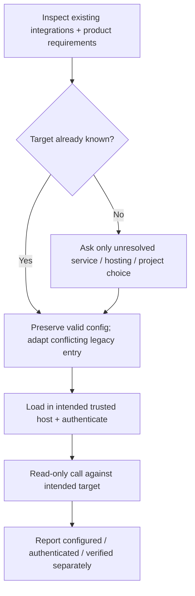

# Set up relevant integrations

Apply during first setup, brownfield adoption, scaffold updates or a relevant MCP failure. Reuse repository configuration, existing secret-loading launchers and settled product decisions. Ask only for missing choices; never ask for a secret in chat or repeat an answered hosting/project question.

- Greenfield = imports cannot reveal an unimplemented product choice. Resolve intended backend/observability from the product plan before configuring those services; no blanket installation of unrelated integrations.
- Brownfield/update = an install/update request covers routine migration within task scope; preserve explicit user restrictions and unrelated customizations. Inspect existing harness entries, actual endpoint, project identity and env owner first; use the pinned source as authority. Migrate incompatible project commands at their owner, preserving security/behavior; preserve custom valid hooks and remove only proven-obsolete Hard Eng-owned hooks, instructions and bootstrap. A legacy Hard Eng entry is not proof of suitability. Unknown consequential choices remain explicit blockers.
- Retirement before repair = identify user-retired tooling before adapting gates. Remove its obsolete workflows and registrations within authorization; do not repair, recreate or add infrastructure for a workflow the user wants retired.
- Older installations retiring Context Mode or Codebase Memory need the current published installer in a fresh process. An already-running older updater can replace tracked files while retaining its old cleanup code; verify local plugin settings and generated state are gone before declaring retirement complete.
- Verification ownership = trace active agent hooks through the native Git hook and CI jobs. A pre-tool `git push --dry-run` invokes pre-push too; remove repeated full verification while retaining any distinct bypass guard. Compare legacy commands against current gate scope/arguments before retiring them. Apply supported installer migrations first; custom workflow or impact-mapping diagnostics remain unfinished adoption work until repaired and verified. Record actual push/CI time and runner minutes, not assumed savings.
- The piped installer has no interactive questionnaire. Unresolved optional services are reported as `MCP setup pending`; the core scaffold is installed so HE Plan can resolve only the missing choices. Supply the known endpoint/host from the existing environment, then rerun setup. Conflicting existing configuration fails before writes. Do not mark setup ready from exit status or a revision marker alone.
- Completion = finish routine repairs and configured CI integration; ensure CI provisions pnpm before pnpm-dependent caching. Local gates prove local setup. When shipping is authorized, use the existing isolated pre-push check on the final rebased commit, including required skill targets even when ignored, then verify hosted required checks. Installation/update does not authorize publication.

| Integration | Selection + proof |
| --- | --- |
| Appwrite | Follow the [canonical MCP owner](../../appwrite-backend/references/mcp-servers.md). `APPWRITE_ENDPOINT` selects Cloud OAuth (`https://mcp.appwrite.io/`) or the self-hosted repo launcher. Reuse an existing valid URL/launcher on updates. Prove the intended endpoint/project with a read-only call. |
| Sentry | Reuse the existing target. New SaaS setup: supply `SENTRY_MCP_URL`, preferably `https://mcp.sentry.dev/mcp/{org}/{project}`; preserve an existing chosen scope. Self-hosted: one executable `scripts/sentry-mcp` resolves its own repo root, loads the existing gitignored env file, validates `SENTRY_HOST` + `SENTRY_ACCESS_TOKEN`, and execs `pnpm dlx @sentry/mcp-server@latest`. Preserve existing compatible launchers/configs. Read-only organization/project access proves readiness; token scopes and unsupported tools follow [Sentry's official server](https://github.com/getsentry/sentry-mcp/tree/main/packages/mcp-core). |
| Dart/Flutter | Official SDK command `dart mcp-server`; verify native initialization and the tools needed for the operation. Existing package-command registrations require migration to the official command before claiming current setup. |
| Marionette | Optional debug-only integration. Registration trigger = any Flutter app, pinned to the `pubspec.lock` version of `marionette_flutter` when locked and unpinned otherwise; detection runs only on install or an applied update, so a package added or upgraded between updates needs a manual pin edit. Registration alone does not configure or connect a running app; [Flutter recorded proof](../../e2e/references/flutter.md) owns the binding, connection and recording steps. |

For Claude Code, setup approves the `.mcp.json` servers it writes through `enabledMcpjsonServers` in `.claude/settings.json`; Claude honors that only once the main repository's folder is trusted, so a worktree of an untrusted repository still shows `Pending approval`.

For Codex, project trust controls loading; hook trust is separate. Inspect `codex mcp list` inside the target root. Use `codex mcp login <name>` for an unauthenticated OAuth server. A newly written entry may require reconnecting or starting a fresh task before tools appear. State that limitation; never claim installation failed solely because the current task cannot see newly configured tools. Do not change global trust/config or create a duplicate global server.

Project instructions live in `AGENTS.md`, read natively by Codex and Claude Code v2.1.277+. Remove redundant Claude import files; review unique rules, relative imports and scope before migrating custom files. Never copy private local instructions into tracked shared files. Ancestor project Claude files can suppress AGENTS loading and need separate cleanup at their owner.

Generated configurations target Codex and Claude Code. Retire other harness registrations during an authorized migration; retain shared instructions and distinct assertions in the supported owners before removing custom integrations.

Probe relevant integrations once when setting them up or relying on them, not every tool call. Unrelated service outages must not trigger a mandatory startup sweep. Keep keys and personal/project details out of public scaffold files and PRs.
