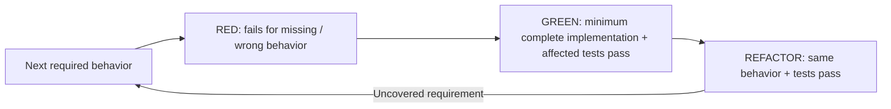

# Test design + quality

Apply when designing, changing or reviewing tests. Reuse the existing framework, fixtures + suite; each case needs a distinct required outcome or meaningful failure.

| Decision | Required proof |
| --- | --- |
| Expected result | Derive from accepted behavior/public contract, independently of the implementation under test. Name precondition + action + observable result; copying the implementation's calculation into the assertion proves neither correct. |
| Boundary | Use the narrowest public seam crossing the behavior's real owner. Assert return/state, emitted contract, visible result or durable effect. Internal calls/structure alone do not prove behavior; behavior-preserving refactors should retain valid tests. |
| Collaborators | Keep the collaborators needed to expose the actual failure. Isolate slow, nondeterministic, destructive or unavailable external boundaries with contract-faithful doubles; add integration proof where the double could hide the defect. Mock calls are sufficient only when those calls are themselves the required contract. |
| Cases | Cover relevant boundaries, invalid/empty inputs, denied access, failure/recovery, concurrency + state/time transitions. Use realistic minimal data; isolate mutable state and avoid timing/order-dependent assertions. No mandatory matrix of unrelated cases. |
| Regression | Show the test fails on the original defective behavior for the expected reason, then passes with the fix. Use an available defective revision or existing controlled reproduction; unavailable red evidence remains a stated gap. Setup/compiler/fixture failures are not valid regression proof. |
| Runtime contract | Compiler/interpreter/runner behavior needs compatible tool execution. Source-text checks establish wiring only. UI/device journeys → [E2E](../../e2e/SKILL.md). |
| Strength | Coverage, execution, snapshots, existence checks + aggregate counts alone cannot establish the intended behavior. Judge whether a realistic wrong result would fail the assertion; remove duplicate or implementation-coupled proof only within task scope. |

## Explicit TDD

Apply only when TDD/red-green-refactor is requested. One observable behavior per increment; reuse the scenario's contract + meaningful seam above.

Harness failure → repair harness before accepting RED. Changed requirements → update expected behavior before continuing; do not generalize production code merely to satisfy an artificial test.

## Completion

- Report behavior + test path + actual results + material gaps using existing task evidence; no separate ledger or behavior-ID scheme.
- Mutation execution uses [Work + verification](workflow.md)'s scope/runtime acceptance rule. If run, inspect meaningful survivors: fix a test gap or explain equivalent/invalid/deferred cases and their consequence. A score alone is insufficient.
- Run applicable project gates. This guidance supports judgment; passing checks cannot certify test quality.
