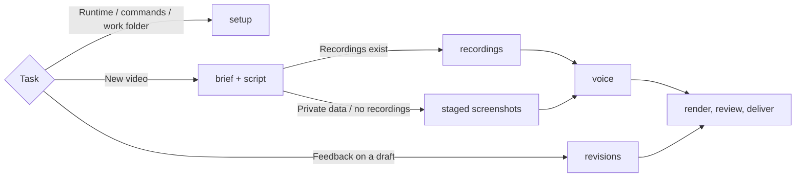

# Marketing Video

Output = real product screens + big brand type + one calm voice → reviewed MP4. Scripts run by path from any directory (`node <skill>/scripts/<name>.mjs <work>`); each video's work folder lives outside the skill.

## Routes

Load only the routes the task reaches.

Recordings come from [Product Walkthrough Video](../product-walkthrough-video/SKILL.md) takes or existing product videos.

## Core rules

- Agent cannot hear → voice, pace + pronunciation = human's call. One sample before every line is generated; never call audio "better" without their listen.
- Real product only: screens, logos + fonts from the product and brand owners. Screens keep their own colours; the brand palette dresses only the graphics around them. Logo file, never a typed brand name; never an invented screen or feature.
- Cut sign-in, invite, loading + empty screens. Access behaviour only when the audience must learn it (training); never a typed password.
- Private data never appears: demo accounts or made-up records.
- Zoom = hand-placed box on what the voice names, whole box in frame. No pointer-following or automatic zoom; a staged cursor never drives the camera.
- Recorded clips → hard cuts. Staged shots/scenes → 0.4 s crossfades allowed. No slow fades to or from black.
- Explanatory graphics copy an approved brand design (deck slide, site section) or the template defaults; no new card, chip or panel styles.
- Plain, specific words, like a colleague showing the product. No hype, slogans or rule-of-three taglines; boldness = type size, layout, motion.
- Human-approved part → frozen. Change only what the latest feedback names.

## Completion gate

All hold on the exact delivered file:

- script approved by the human; every claim backed by product material;
- `build.mjs` passes; `render.mjs` reported no page errors;
- every audit sheet opened, flat runs explained, stills checked at clicks, zooms + graphic scenes;
- mix transcript holds every line in order;
- delivered with draft number + change summary; voice quality stated as the human's judgment; music licence status stated.

Human step not done (no script approval, no voice listen) → deliver as a draft that names each unmet item; never call it complete.
