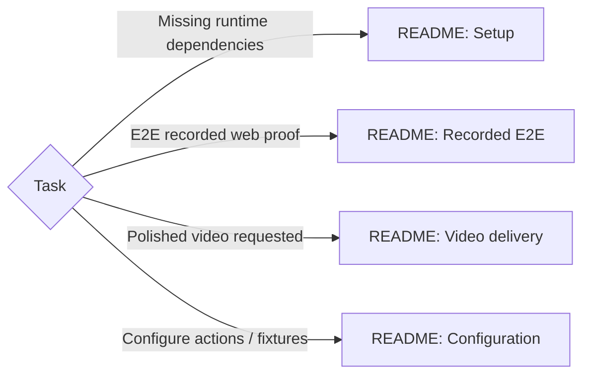

# Product Walkthrough Video

Use the bundled recorder + review scripts for both routes; conversion belongs to video delivery. Recording changes pacing and may bridge reload paint: raw rendering or timing claims need separate evidence. [E2E](../e2e/SKILL.md#prove-the-journey) owns product assertions, durable-state proof + defect reopening.

Load matching README sections; commands run from this skill's directory.

Completion = selected route's [completion gate](README.md#completion-gate) on the exact reviewed artifact. Mechanical success without actual visual review remains incomplete.
