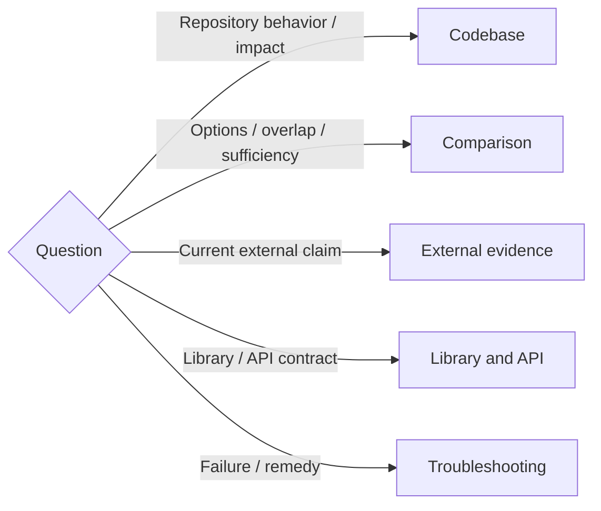

# Research

## Approach

- Start = decision to answer + relevant scope + settled constraints + required freshness. Reuse answers already available.
- Coverage = derive relevant questions from the problem and authoritative sources before evaluating options. User-named tools and questions are the minimum, not the whole investigation.
- Evidence = repository source for local behavior; official docs/source/changelogs for external contracts; issues, Reddit and other community reports for discovery and practical counterexamples.
- Independence = search by the problem as well as named solutions; inspect credible alternatives and evidence against the preferred answer where they could change the decision.
- Claims = distinguish documented capability, locally observed behavior, inference and unknown. Missing evidence does not establish that a capability is absent.
- Proportion = investigate what can change the answer; no fixed search quota, mandatory report or unrelated audit.
- Scope = reuse existing task authorization; research alone adds no permission for installation, implementation or external writes. Continue useful independent investigation when one source is unavailable.

## Routes

Read each reference whose question is part of the task; skip unrelated routes.

## Completion

- Before concluding, revisit the original question and derived coverage: each material item has evidence, a reason it does not apply, or an explicit unknown and its consequence.
- Resolve material contradictions by source authority, version and applicability; keep unresolved disagreements visible.
- Claim sufficiency only for the stated scope. Name meaningful remaining gaps and explain why they are acceptable or prevent a recommendation.
- Stop when remaining investigation is unlikely to change the decision, or the missing evidence and next useful check are clear. Do not promise exhaustive certainty.
- Answer first, cite decisive sources beside claims, and explain tradeoffs and limits. Use a compact comparison table when it helps; do not force fixed report sections.
- Record accepted decisions in the existing decision file when requested. Keep proposals and unknowns separate; create reusable notes only when requested or needed by subsequent work.
