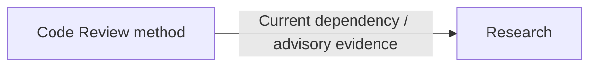

# Security Review

Load the review method; use Research when dependency/advisory claims need current evidence. Reuse existing fix/testing authority; review alone adds no remediation or live-exploitation authority.

- Trace = sensitive asset + caller/input + required permission → actual enforcing owner → operation/data. UI visibility or a caller's check does not prove server authorization.
- Coverage = focused change → affected path + adjacent callers; broad review → actual entry points + assets, then relevant surfaces below. Mark material missing evidence.

| Surface | Resolve |
|---|---|
| Identity / sessions | Caller-selected identity, role or tenant; login, recovery, expiry + revocation boundaries. |
| Data / privilege | Actor + tenant enforcement for object, field, list/export + mutation; alternate entry points. |
| Input / files | Query, markup, URL, path, upload/archive → normalization + downstream parser, fetch, storage or execution. |
| Secrets / artifacts | Source, logs, client bundle, generated config + packaged output exposure; inspect the actual in-scope artifact. Internal address alone ≠ secret. |
| LLM / tools | Untrusted content influencing privileged actions; permissions + validated arguments outside the model; required approval at the action boundary. |
| Dependencies | Resolved lockfile/image/SBOM/runtime version + existing scan + primary advisory ranges. Trace production/build/dev/transitive use; manifest range ≠ resolved version. Confirmed vulnerable version ≠ proven exploitability; unknown reachability never waives a required gate. |

- Finding = entry point + actor/input preconditions + enforcing/missing control + affected asset + realistic impact. Test competing explanations through source + permitted probes; unproven exploit path stays unknown.
- Secret evidence = type + location + exposure path; mask values. Keep findings, optional hardening + unresolved questions distinct.
- Authorized fix = smallest control satisfying the requirement; verify original unauthorized path denied + legitimate access preserved at the actual permission/input boundary. Run applicable gates.
- Result = assessed surfaces + findings + gaps. Scanner success proves only its checked scope; no whole-application certification or implied runtime proof.
