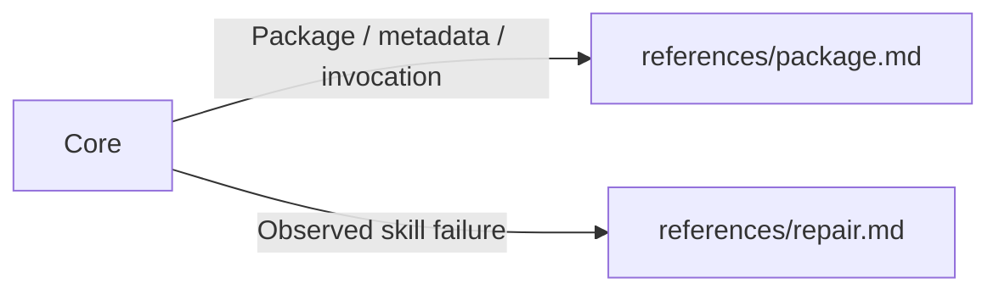

# Writing Great Skills

- Scope = user request + settled constraints + existing authorization; skill adds no authority.
- Agent prose = minimum tokens + unambiguous meaning. Use `=`, `→`, `+`, terse bullets/tables where clear; delete filler + repetition. Preserve conditions, actions, exceptions and proof; cryptic abbreviations ≠ useful compression.

## Routes

Load matching routes only; Core always applies.

## Core

| Check | Required outcome |
| --- | --- |
| Need | Removal loses reusable, non-default behavior; omit generic agent advice. |
| Trigger | Purpose + distinct use; relevant prompts match, unrelated prompts do not. Preserve implicit selection unless user requests explicit-only. |
| Disclosure | `SKILL.md` = routes + essential shared rules. Conditional workflows/examples/detail → references. Each route = load condition + direct link; load only applicable routes. Keep short universal rules inline. |
| Diagram | Flow, decision, state or dependency → Mermaid by default. Terse labels; one representation, no prose duplicate. Non-relational rule → bullet/table. |
| Split | Same actions + proof → keep together. Split for independent use or observed failure unresolved by clearer completion. |
| Resource | Script = repeated fragile logic; reference = conditional knowledge; asset = copied output. Each needs a current consumer; no mandatory file count. |
| Ownership | Rule + definition + caveat = one owner. Inspect package + relevant siblings/project instructions; consolidate duplicates + remove stale rules. |
| Steering | State target action + observable completion; likely mistake → replacement action. |
| Validation | Available native validator + changed links/tools/skills exist + metadata agrees. Substantial/risky change → representative trigger/non-trigger prompts + actual outcome proof. Run changed scripts; wording tests ≠ behavior proof. |
