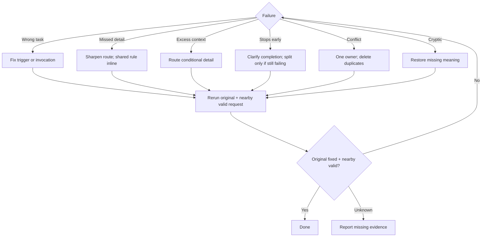

# Repair observed skill failures

Input = request + observed failure + intended outcome. Fix the smallest owner.

```mermaid
flowchart TD
  F{Failure}
  F -->|Wrong task| T[Fix trigger or invocation]
  F -->|Missed detail| M[Sharpen route; shared rule inline]
  F -->|Excess context| E[Route conditional detail]
  F -->|Stops early| S[Clarify completion; split only if still failing]
  F -->|Conflict| O[One owner; delete duplicates]
  F -->|Cryptic| C[Restore missing meaning]
  T & M & E & S & O & C --> R[Rerun original + nearby valid request]
  R --> V{Original fixed + nearby valid?}
  V -->|Yes| D[Done]
  V -->|No| F
  V -->|Unknown| G[Report missing evidence]
```

New universal rule requires demonstrated need.
